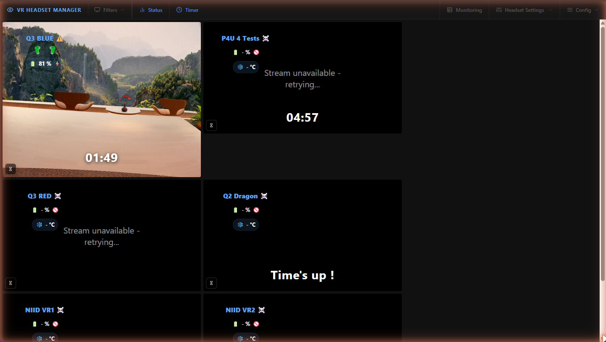

<!-- NOTE: when moving this file to the repository root, prefix every relative link with "docs/" (e.g. installation.md -> docs/installation.md, pics/logo.svg -> docs/pics/logo.svg). -->

**Manage, monitor and screen-mirror a fleet of VR headsets — from one PC.**

---

**VR HEADSET MANAGER** (VRHM) is a Windows automation tool that manages, monitors, and captures the screens of **Meta Quest** and **PICO** VR headsets over WiFi, using **ADB** and [**scrcpy**](https://github.com/Genymobile/scrcpy).

It is built for **VR labs, showrooms, gaming exhibitions, training centers, and any multi-headset deployment** where an operator needs a global, real-time view of every active VR experience — typically to feed live video walls or **OBS**.

*The Video Monitor web page: one tile per headset with live video, battery, controllers, and session timer.*

## Features

- **Live screen capture** of every headset (scrcpy), restreamed over the network as **WHEP (WebRTC), RTSP, and HLS** through [MediaMTX](https://github.com/bluenviron/mediamtx)
- **Web interface** to watch all streams with very low latency, manage headsets, and change every setting — from any device on your LAN
- **Auto-restart**: streams come back automatically when a headset reappears on the network
- **Health monitoring**: headset and controller battery, charge status, temperature — with per-headset HTML overlays ready to drop into OBS
- **Session timers** per headset (limit play sessions), controllable from the web page or any external tool via a [REST API](docs_timer_api.md) (Stream Deck, OBS, curl...)
- **Applications manager**: install (sideload), uninstall, and launch apps on any headset remotely — the player never has to touch a menu
- **Recording** of any capture session to disk
- **Automatic WiFi-ADB activation** when a known headset is plugged in over USB
- **Video Quality Automation**: monitors your PC's CPU/GPU load and recommends (or applies) resolution/framerate/bitrate reductions to keep the machine responsive

## Quick start

1. Download the [latest release](https://github.com/lyon-esport/VR_HEADSET_MANAGER/releases) and unzip it (keep `VR_HEADSET_MANAGER` in the folder name).
2. Run **`START_VR_HEADSET_MANAGER.exe`**. On first start it configures the Windows Firewall (asks for admin) and creates the config files.
3. Open the web interface — the URL is printed in the console, by default **`http://<your-pc-ip>:8080`**.
4. Put your headset in **Developer Mode**, plug it in over USB, and add it via **Headset Settings → Manage New Devices**.
5. Start the stream from the **Video Monitor** page — done.

Full details: [Installation](installation.md) → [Getting started](getting-started.md).

## Documentation

| Page | What you will find |
|---|---|
| [Installation](installation.md) | Prerequisites, first run, firewall/Defender setup, updating |
| [Getting started](getting-started.md) | Add your first headset and start streaming (web interface) |
| [Web interface tour](web-interface.md) | Every page of the web UI explained |
| [Streaming & OBS](streaming.md) | Capture pipeline, stream URLs, re-encoding, OBS integration, recording |
| [Applications manager](apps-manager.md) | Launch, sideload, uninstall and update apps on headsets |
| [Kiosk screens](kiosk-screens.md) | Remote-control browser displays (lobby TVs, showroom monitors): push URLs, cast a headset's live feed |
| [Configuration reference](configuration.md) | Every `config.json` setting, ports, WiFi credentials |
| [Video Quality Automation](vqa.md) | Automatic performance mitigation explained |
| [Timer API](docs_timer_api.md) | REST API for per-headset session timers |
| [Enable ADB over WiFi](docs_HowToEnableADBWifi.md) | How to enable wireless ADB on a Meta Quest |
| [Troubleshooting](troubleshooting.md) | Common problems and how to fix them |
| [Changelog](CHANGELOG/) | What changed in each release (one file per release) |

## Supported headsets

| Model | Status |
|---|---|
| Meta Quest 3 | Fully supported (including per-eye crop profiles) |
| Meta Quest 2 | Fully supported |
| PICO 4 Ultra | Supported |
| Other Android-based headsets | Should work over WiFi ADB — profiles may need tuning |

> [!NOTE]
> Support for a new model is mostly a matter of adding a capture profile. Open a [GitHub issue](https://github.com/lyon-esport/VR_HEADSET_MANAGER/issues) if you need a new headset supported. *(And if you want to offer the author a headset, he will be pleased to support it in the next release! 😁)*

## Requirements at a glance

- Windows 10/11 PC on the same network as the headsets (Ethernet recommended for the PC)
- Headsets in **Developer Mode** with **ADB over WiFi** reachable
- Hardware: minimum 4 CPU cores, 16 GB RAM, 2 GB GPU VRAM for ~4 headsets

See [Installation](installation.md) for the full list.

## License

Licensed under the **PolyForm Noncommercial License 1.0.0** — free for personal use and internal non-commercial business use; selling or commercial usage is not allowed. See [LICENSE](../LICENSE.md).

## Credits

VR HEADSET MANAGER stands on the shoulders of:

- [scrcpy](https://github.com/Genymobile/scrcpy) — screen mirroring
- [oculus-wireless-adb](https://github.com/thedroidgeek/oculus-wireless-adb) — enable ADB over WiFi from inside the headset
- [MediaMTX](https://github.com/bluenviron/mediamtx) — real-time media server for restreaming
- [MetaMetadata](https://github.com/threethan/MetaMetadata) — the database linking package names to app names and icons
- [Pode](https://github.com/Badgerati/Pode) & [EPS](https://github.com/straightdave/eps) — PowerShell web server and templating
