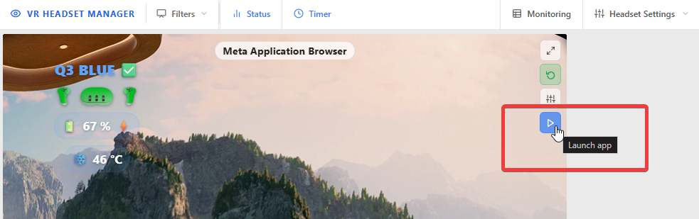
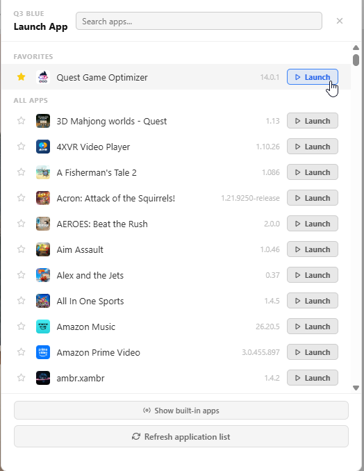
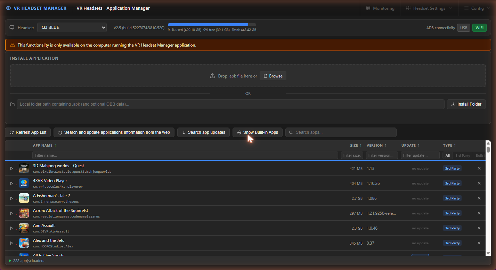
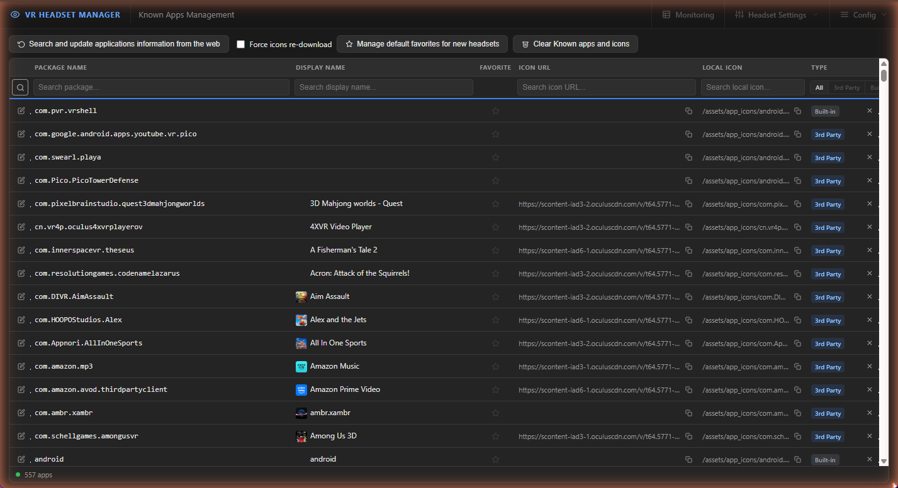

# Applications manager

[← Back to documentation home](README.md)

VR HEADSET MANAGER lets the operator drive every application on every headset **without the player ever leaving the experience**: launch games remotely, sideload new ones, uninstall, and apply pending updates.

## Built-in vs 3rd-party apps

| Type | What it is | Can be removed? |
|---|---|---|
| **Built-in** | System applications shipped by Meta/PICO | No |
| **3rd Party** | Everything installed from the store **or sideloaded** | Yes |

## Launching apps remotely

Wherever you see a **launch button (▶)** — on Video Monitor tiles, on Headset Settings cards, next to each app in the Application Manager — clicking it starts that application inside the headset immediately. The person wearing the headset does not need to do anything: you play the operator, they stay in the matrix.

*The Launch app button on a Video Monitor tile...*

*...opens the app picker: favorites on top, then every installed app, with search and one-click Launch.*

Each headset also has **favorite apps** (star icon) so your event's games are always one click away.

## The Application Manager page

**Config → Headsets Apps**, then select a headset:

From top to bottom:

- **Header**: firmware version, storage gauge of the headset, and the active ADB transport (**USB / WIFI**)
- **Install application**: drag-and-drop an `.apk` file, or give a **local folder** containing the `.apk` plus its optional OBB data folder — VRHM pushes everything to the headset with a progress bar (installs can be cancelled mid-way)
- **App list**: every installed application with icon, name, package, size on disk, version, pending update, and type — with launch (▶), filter, sort, and uninstall (✕) controls

> [!NOTE]
> Installing APK files is only available when browsing the web UI **from the VRHM computer itself** (the server needs direct access to the file you pick).

> [!TIP]
> Counter-intuitively, pushing an app over **WiFi ADB is often faster than USB**: the transfer goes through ADB (not MTP), which is the bottleneck.

### App updates

**Search app updates** finds update sessions already staged on the headset (downloaded by the store but not applied) and lets you commit them immediately — handy to force-update a game before the doors open. OTA firmware updates can also be **blocked/unblocked** per headset from Headset Settings → Advanced Settings, so a headset does not decide to update itself in the middle of an event.

## Known apps catalog

**Config → Known Apps** manages the shared catalog that maps Android package names (like `com.beatgames.beatsaber`) to display names and icons used everywhere in the UI:

- **Search and update applications information from the web** fetches missing names and icons from the [MetaMetadata database](https://github.com/threethan/MetaMetadata) (requires internet access; run it manually whenever you add new games)
- Names, icons, favorites and type can also be edited by hand — handy for custom/sideloaded apps that no database knows
- **Manage default favorites for new headsets** defines the favorite set applied to every newly added headset
- **Clear Known apps and icons** resets the catalog to the shipped defaults (the previous catalog is archived, not lost)
