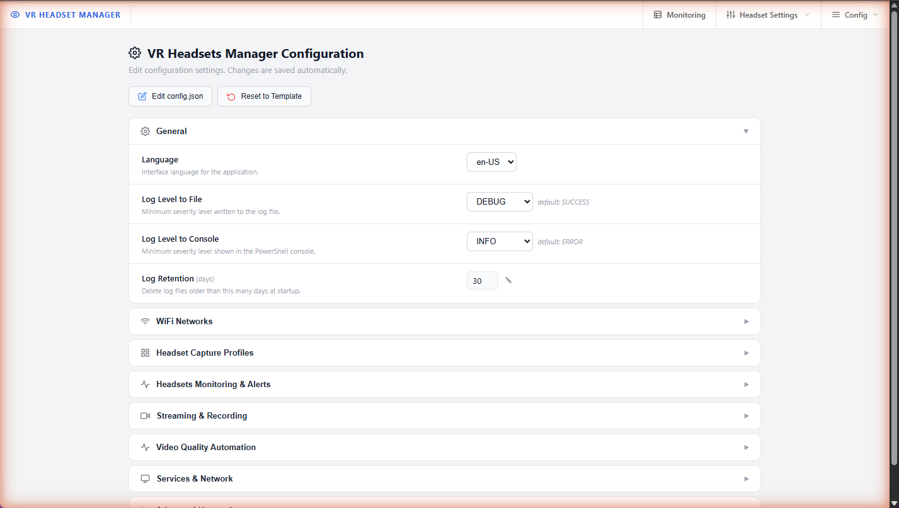

# Configuration reference

[← Back to documentation home](README.md)

## Where the configuration lives

- Runtime configuration: **`config\config.json`** — created automatically from the template on first run
- Template with defaults: `templates\config\config.json`

Two ways to edit:

1. **Web interface (recommended)** — **Config → App Configuration**. Changes are saved automatically; streaming-related changes restart the affected services on the fly, other changes may require an application restart.

   

2. **Directly in `config\config.json`** — the same page has an **Edit config.json** button. If the file becomes invalid JSON, the console offers to retry, restore the template, or quit at next startup. **Reset to Template** restores all defaults.

## Ports summary

| Port | Protocol | Used by | Config key |
|---|---|---|---|
| 8080 | HTTP | Web interface & API | `WebServer.port` |
| 8554 | RTSP | MediaMTX stream output | `mediamtx.rtsp_port` |
| 8888 | HTTP | MediaMTX HLS output | `mediamtx.hls_port` |
| 8889 | HTTP | MediaMTX WebRTC/WHEP output | `mediamtx.webrtc_port` |
| 9997 | HTTP | MediaMTX API | `mediamtx.api_port` |
| 5555 | TCP | ADB over WiFi (on the headsets) | `ADB.adbPort_default` |

> [!NOTE]
> At startup VRHM checks that every port it needs is actually free. If one is taken by another program, an interactive resolver proposes to pick the next free port (and saves it back to the config), enter one manually, or kill the offending process.

## Section by section

### `language`

`en-US` (default) or `fr-FR`. Interface language for console messages.

### `Paths`

File names of the headset registry (`known_headsets.csv`) and app catalog (`known_apps.csv`) inside `data\`. Normally never changed.

### `apk`

Location and package name of the bundled [oculus-wireless-adb](https://github.com/thedroidgeek/oculus-wireless-adb) APK that VRHM can install on a headset to enable ADB over WiFi without a cable.

### `Logging`

| Key | Default | Description |
|---|---|---|
| `debugLevelToFile` | `SUCCESS` | Minimum severity written to `logs\<COMPUTER>\log_<date>.txt` |
| `debugLevelToConsole` | `ERROR` | Minimum severity shown in the console |
| `logRetentionDays` | `30` | Log files older than this are deleted at startup |

Levels: `DEBUG` < `INFO` < `SUCCESS` < `WARNING` < `ERROR` < `NONE`.

### `VRMonitor`

| Key | Default | Description |
|---|---|---|
| `refresh_timer` | `5` | Headset polling interval in seconds |
| `showConsole` | `false` | Open a separate live dashboard console window |

### `ComputerMonitoring`

CPU/RAM/GPU/drive statistics collection: refresh interval (`refresh_timer_sec`, default 60) and output file name. Shown on the [Monitoring page](web-interface.md#monitoring).

### `VideoQualityAutomation`

All thresholds and switches of the automatic quality mitigation — explained in detail on the [Video Quality Automation](vqa.md) page.

### `ADB`

| Key | Default | Description |
|---|---|---|
| `folder` | `scrcpy\scrcpy-win64-v...` | scrcpy/ADB binaries folder inside `sources\` (the scrcpy release bundles `adb.exe`, so this always holds the same value as `scrcpy.folder`) |
| `adbPort_default` | `5555` | Default ADB WiFi port |

Each scrcpy version lives in its own folder under `sources\scrcpy\`, so several can coexist; this key selects the active one. Switch versions from the web UI (Configuration -> Advanced) rather than editing it by hand.

### Headset Capture Profiles (`scrcpy`)

| Key | Default | Description |
|---|---|---|
| `folder` | `scrcpy\scrcpy-win64-v...` | Same value as `ADB.folder` above |
| `recordFolder` | `C:\DATA\MEDIA\VR_Records` | Where recordings are written |
| `recordMinFreeSpaceGB` | `5` | Below this free space, recording is disabled automatically |
| `parameters.<Model>` | — | Per-model capture profiles (see below) |

Each supported model (`Quest 3`, `Quest 2`, `PICO 4 Ultra`) defines:

- `views` — named crop presets (`max`, `square`, `portrait`, `wide`, `fullscreen`), each with a per-eye `crop` rectangle (`width:height:x:y`) and de-tilting `angle`
- `max_size` — long-edge resolution cap in pixels (`0` = uncapped)
- `video_codec` / `video_encoder` — codec (h264) and optional specific Android encoder
- `video_buffer` — buffering in ms (jitter smoothing vs latency)
- `stay_awake` — keep the headset awake while captured

The profile string assigned to each headset (`max-R-N-30-8`...) picks a view from here; format explained in [Streaming → capture profiles](streaming.md#scrcpy-capture-profiles).

### `Monitoring`

Alert thresholds used by the web UI and the OBS overlays:

| Key | Default |
|---|---|
| `headset_battery_warningLevel` / `criticalLevel` | 40 / 30 % |
| `controllers_battery_warningLevel` / `criticalLevel` | 30 / 15 % |
| `temperature_highLevel` | 50 °C |

### `mediamtx`

| Key | Default | Description |
|---|---|---|
| `enabled` | `true` | Master switch for restreaming |
| `folder` | `MediaMTX\mediamtx_v...` | MediaMTX binary folder inside `sources\` |
| `rtsp_port` / `hls_port` / `webrtc_port` / `api_port` | 8554 / 8888 / 8889 / 9997 | Output ports |
| `stream_framerate` | `30` | Target fps when re-encoding |
| `stream_bitrate` | `6M` | Target bitrate when re-encoding |
| `reencode_in_ffmpeg` | `true` | `true` = re-encode to the values above (default), `false` = passthrough (`-c copy`) ([details](streaming.md#ffmpeg-re-encoding-and-streaming-options)) |
| `codec` | `h264` | Re-encoding codec: `h264` or `h265` |

### `VideoMonitor`

Browser-side behavior of the video wall: pause hidden streams after `pauseWhenHiddenDelay_sec` (default 10 s) to save bandwidth when the tab is not visible.

### `WebServer`

`enabled` (default `true`), `port` (default `8080`), and `openBrowserOnStartup` (default `true`) - automatically opens the default web browser to the dashboard when the app starts.

### `MdnsResponder`

Optional mDNS responder so the web UI is reachable at `http://vrhm.local` instead of an IP. Disabled by default (mDNS resolution works from computers, but most mobile devices ignore it).

### `Battery`

`headset_charging_power_W` (default 13) — expected charger wattage, used to flag slow charging.

### `Performance`

| Key | Default | Description |
|---|---|---|
| `GPU_Acceleration` | `true` | Use the GPU for video work |
| `GPU_Index` | `0` | Which GPU to use (see GPU list on the Monitoring page) |
| `Capture_Mode` | `StreamAndLocalWindow` | Whether captures show a local window in addition to streaming |
| `Adaptive_Monitoring.enabled` | `true` | Slow down polling of unreachable headsets |

## WiFi credentials (not in config.json)

WiFi networks that VRHM can push to headsets (**Config → App Configuration → WiFi Networks**) are **not stored in `config.json`**. They are encrypted with Windows DPAPI in `data\wifi_networks.dat` — readable only by your Windows user on this machine, and never shipped in releases.

## Headset registry

The headset list itself lives in `data\known_headsets.csv` (name, IP, serial, model, profile, per-headset switches). Manage it from the web UI ([Headset Settings](web-interface.md#headset-settings)) rather than editing the file by hand.
