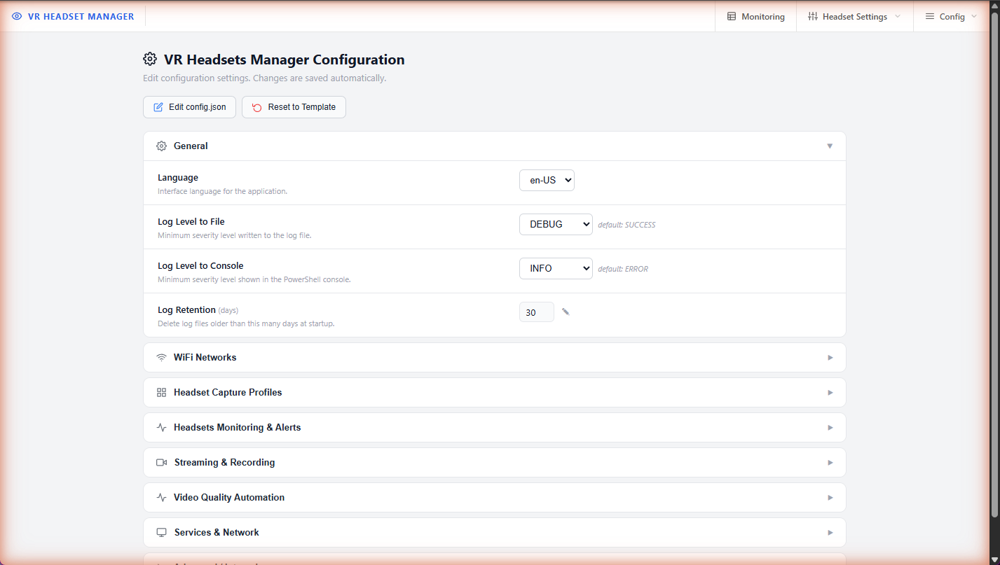

# Configuration reference

[← Back to documentation home](README.md)

## Where the configuration lives

- Runtime configuration: **`config\config.json`** — created automatically from the template on first run
- Template with defaults: `templates\config\config.json`

Two ways to edit:

1. **Web interface (recommended)** — **Config → App Configuration**. Changes are saved automatically; streaming-related changes restart the affected services on the fly, other changes may require an application restart.

   

2. **Directly in `config\config.json`** — the same page has an **Edit config.json** button. If the file becomes invalid JSON, the console offers to retry, restore the template, or quit at next startup. **Reset to Template** restores all defaults.

## Ports summary

| Port | Protocol | Used by | Config key |
|---|---|---|---|
| 8080 | HTTP | Web interface & API | `WebServer.port` |
| 8554 | RTSP | MediaMTX stream output | `mediamtx.rtsp_port` |
| 8888 | HTTP | MediaMTX HLS output | `mediamtx.hls_port` |
| 8889 | HTTP | MediaMTX WebRTC/WHEP output | `mediamtx.webrtc_port` |
| 9997 | HTTP | MediaMTX API | `mediamtx.api_port` |
| 5555 | TCP | ADB over WiFi (on the headsets) | `ADB.adbPort_default` |

> [!NOTE]
> At startup VRHM checks that every port it needs is actually free. If one is taken by another program, an interactive resolver proposes to pick the next free port (and saves it back to the config), enter one manually, or kill the offending process.

## Section by section

### `language`

`en-US` (default) or `fr-FR`. Interface language for console messages.

### `Paths`

File names of the headset registry (`known_headsets.csv`) and app catalog (`known_apps.csv`) inside `data\`. Normally never changed.

### `apk`

Location and package name of the bundled [oculus-wireless-adb](https://github.com/thedroidgeek/oculus-wireless-adb) APK that VRHM can install on a headset to enable ADB over WiFi without a cable.

### `Logging`

| Key | Default | Description |
|---|---|---|
| `debugLevelToFile` | `SUCCESS` | Minimum severity written to `logs\<COMPUTER>\log_<date>.txt` |
| `debugLevelToConsole` | `ERROR` | Minimum severity shown in the console |
| `logRetentionDays` | `30` | Log files older than this are deleted at startup |

Levels: `DEBUG` < `INFO` < `SUCCESS` < `WARNING` < `ERROR` < `NONE`.

### `VRMonitor`

| Key | Default | Description |
|---|---|---|
| `refresh_timer` | `5` | Headset polling interval in seconds |
| `showConsole` | `false` | Open a separate live dashboard console window |

### `ComputerMonitoring`

CPU/RAM/GPU/drive statistics collection: refresh interval (`refresh_timer_sec`, default 60) and output file name. Shown on the [Monitoring page](web-interface.md#monitoring).

### `VideoQualityAutomation`

All thresholds and switches of the automatic quality mitigation — explained in detail on the [Video Quality Automation](vqa.md) page.

### `ADB`

| Key | Default | Description |
|---|---|---|
| `folder` | `scrcpy\scrcpy-win64-v...` | scrcpy/ADB binaries folder inside `sources\` (the scrcpy release bundles `adb.exe`, so this always holds the same value as `scrcpy.folder`) |
| `adbPort_default` | `5555` | Default ADB WiFi port |
| `prefer_usb` | `true` | When a known headset is cabled to this PC, use USB for every ADB call and for the scrcpy capture, and fall back to WiFi when the cable drops. `false` keeps everything on WiFi. Takes effect after an application restart |

Each scrcpy version lives in its own folder under `sources\scrcpy\`, so several can coexist; this key selects the active one. Switch versions from the web UI (Configuration -> Advanced) rather than editing it by hand.

### Headset Capture Profiles (`scrcpy`)

| Key | Default | Description |
|---|---|---|
| `folder` | `scrcpy\scrcpy-win64-v...` | Same value as `ADB.folder` above |
| `recordFolder` | `C:\DATA\MEDIA\VR_Records` | Where recordings are written |
| `recordMinFreeSpaceGB` | `5` | Below this free space, recording is disabled automatically |
| `usb_switch_mode` | `stable` | What a RUNNING capture does when its headset gets cabled: `stable` (switch after the delay below, never while recording), `immediate`, or `next_start` (never interrupt, use USB at the next start). A capture on USB always falls back to WiFi when the cable is removed |
| `usb_switch_stable_sec` | `10` | How long the cable must stay connected before `stable` mode moves a capture to USB |
| `parameters.<Model>` | — | Per-model capture profiles (see below) |

Each supported model (`Quest 3`, `Quest 2`, `PICO 4 Ultra`) defines:

- `views` — named crop presets (`max`, `square`, `portrait`, `wide`, `fullscreen`), each with a per-eye `crop` rectangle (`width:height:x:y`) and de-tilting `angle`
- `max_size` — long-edge resolution cap in pixels (`0` = uncapped)
- `video_codec` / `video_encoder` — codec (h264) and optional specific Android encoder
- `video_buffer` — buffering in ms (jitter smoothing vs latency)
- `stay_awake` — keep the headset awake while captured
- `eye_merge` — *optional*, the **eye merge calibration** that enables the Merged (`M`) eye for this model. Its presence (and `enabled: true`) is what makes a model "supported". Written by the **Calibrate** / **Import JSON** buttons, not by hand:

  | Key | Meaning |
  |---|---|
  | `enabled` | `false` keeps the calibration but hides the Merged option |
  | `frame_width` / `frame_height` | Full side-by-side frame the calibration was measured on; a headset sending another size falls back to the right eye |
  | `relative_angle`, `shift_x`, `shift_y` | Rotation (degrees) and shift (pixels) between the two eye pictures |
  | `level_angle` | Rotation that levels the merged picture (half the relative angle) |
  | `base_eye` | `R` (default) or `L`: the main eye of views that do not choose their own (`merged.base_eye`) |
  | `feather_px` / `inset_px` | Width of the blend band at the base eye's lens edge, and its distance from the edge |
  | `lens_focal_px` / `ipd_m` | *Optional* lens model of the **merge depth**: fisheye focal of the merged picture (pixels per radian, 1150 on a Quest 3) and eye spacing in metres (default 0.063). Without `lens_focal_px` the merge depth is not offered. Kept by a recalibration |
  | `mask_left` / `mask_right` | Lens outlines, `"x,y x,y ..."` in eye pixels |
  | `canvas_width` / `canvas_height` | Size of the merged picture the view framings are drawn on |
  | `score`, `calibrated_at`, `calibrated_by`, `notes` | Information only |

  Any view may also carry `"transparent_corners": true` (checkbox in the visual editor, console scrcpy options `[8]`): for every eye (L, R or Merged) the area outside the lenses is shown **transparent** in the web video pages and OBS Browser Sources. It needs the model's lens outlines, i.e. an eye merge calibration (enabled or not). An RTSP/HLS player still shows those corners black - the video itself cannot carry transparency.

  Each view may then carry `"merged": { "crop": "w:h:x:y", "depth_m": 0.75, "base_eye": "L" }` — its framing of the merged picture, drawn on the **Merged** tab of the visual editor, and its **merge depth**. Without `crop`, the largest clean rectangle with the shape of the view's eye crop is used. `depth_m` (0.3 to 100 m, absent = far) is the distance at which the two eyes line up where they are blended: far suits scenery and rooms, a near value (menus, a table, objects held close) aligns close objects but doubles far ones in the blend band. `base_eye` is the view's main eye, which gives the centre of the picture (absent = the calibration's `base_eye`, R); the depth never moves it. Keep two views (e.g. `max` far and `max_near` at 0.75 m) to switch a headset between them.

The profile string assigned to each headset (`max-R-N-30-8`...) picks a view from here; format explained in [Streaming → capture profiles](streaming.md#scrcpy-capture-profiles).

### `Monitoring`

Alert thresholds used by the web UI and the OBS overlays:

| Key | Default |
|---|---|
| `headset_battery_warningLevel` / `criticalLevel` | 40 / 30 % |
| `controllers_battery_warningLevel` / `criticalLevel` | 30 / 15 % |
| `temperature_highLevel` | 50 °C |
| `temperature_warningLevel` | 42 °C |
| `cpu_temperature_warningLevel` / `cpu_temperature_highLevel` | 75 / 85 °C |
| `gpu_temperature_warningLevel` / `gpu_temperature_highLevel` | 75 / 85 °C |

CPU and GPU have their own bands because they run far hotter than the battery under load (a Quest 3 sits around 60-65 °C while streaming). Battery and skin temperatures use `temperature_*Level`. The bands colour the DIAG page tiles and the metric-history graphs.

### `Diag`

Settings of the headset DIAG page (see [Web interface](web-interface.md#headset-diag)):

| Key | Default | Description |
|---|---|---|
| `auto_refresh_sec` | `30` | How often the page re-reads its sections while auto-refresh is on |
| `cable_test_passes` | `3` | Push/pull passes run by the USB cable throughput test and the WiFi throughput test |
| `command_presets` | 4 presets | List of `{ "name", "command" }` shown in the ADB shell panel. Edited in `config.json` (the config page has no editor for it) |

### `mediamtx`

| Key | Default | Description |
|---|---|---|
| `enabled` | `true` | Master switch for restreaming |
| `folder` | `MediaMTX\mediamtx_v...` | MediaMTX binary folder inside `sources\` |
| `rtsp_port` / `hls_port` / `webrtc_port` / `api_port` | 8554 / 8888 / 8889 / 9997 | Output ports |
| `stream_framerate` | `30` | Target fps when re-encoding |
| `stream_bitrate` | `6M` | Target bitrate when re-encoding |
| `reencode_in_ffmpeg` | `true` | `true` = re-encode to the values above (default), `false` = passthrough (`-c copy`) ([details](streaming.md#ffmpeg-re-encoding-and-streaming-options)) |
| `codec` | `h264` | Re-encoding codec: `h264` or `h265` |

### `VideoMonitor`

Browser-side behavior of the video wall: pause hidden streams after `pauseWhenHiddenDelay_sec` (default 10 s) to save bandwidth when the tab is not visible.

### `WebServer`

`enabled` (default `true`), `port` (default `8080`), and `openBrowserOnStartup` (default `true`) - automatically opens the default web browser to the dashboard when the app starts.

### `Network`

`waitForValidNetwork` (default `true`) - pauses startup if no network interface has a valid (non-APIPA) IP yet, re-checking every `checkIntervalSeconds` (default 5) until DHCP assigns one. Press any key during the wait to skip it and continue startup anyway.

### `MdnsResponder`

Optional mDNS responder so the web UI is reachable at `http://vrhm.local` instead of an IP. Disabled by default (mDNS resolution works from computers, but most mobile devices ignore it).

### `Battery`

`headset_charging_power_W` (default 13) — expected charger wattage, used to flag slow charging.

### `Performance`

| Key | Default | Description |
|---|---|---|
| `GPU_Acceleration` | `true` | Use the GPU for video work |
| `GPU_Index` | `0` | Which GPU to use (see GPU list on the Monitoring page) |
| `Capture_Mode` | `StreamOnly` | Whether captures show a local window in addition to streaming |
| `Adaptive_Monitoring.enabled` | `true` | Slow down polling of unreachable headsets |

## WiFi credentials (not in config.json)

WiFi networks that VRHM can push to headsets (**Config → App Configuration → WiFi Networks**) are **not stored in `config.json`**. They are encrypted with Windows DPAPI in `data\wifi_networks.dat` — readable only by your Windows user on this machine, and never shipped in releases.

## Headset registry

The headset list itself lives in `data\known_headsets.csv` (name, IP, serial, model, profile, per-headset switches). Manage it from the web UI ([Headset Settings](web-interface.md#headset-settings)) rather than editing the file by hand.
