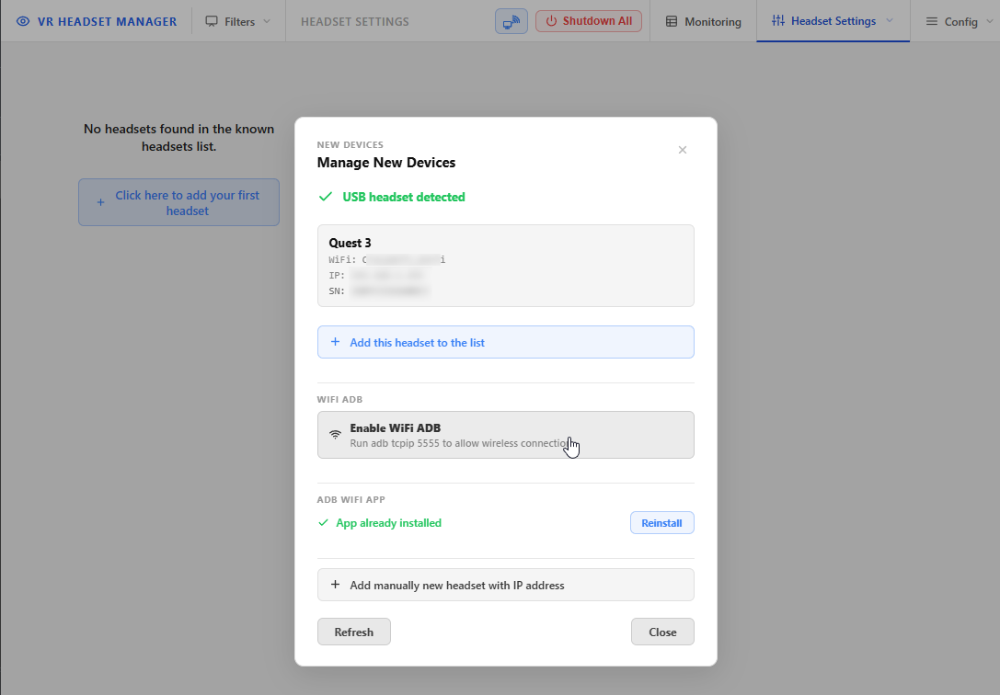
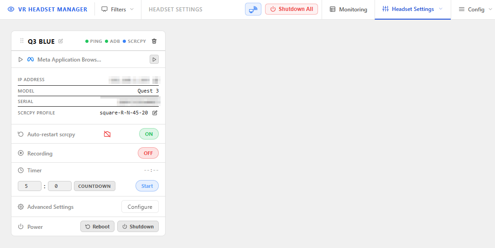
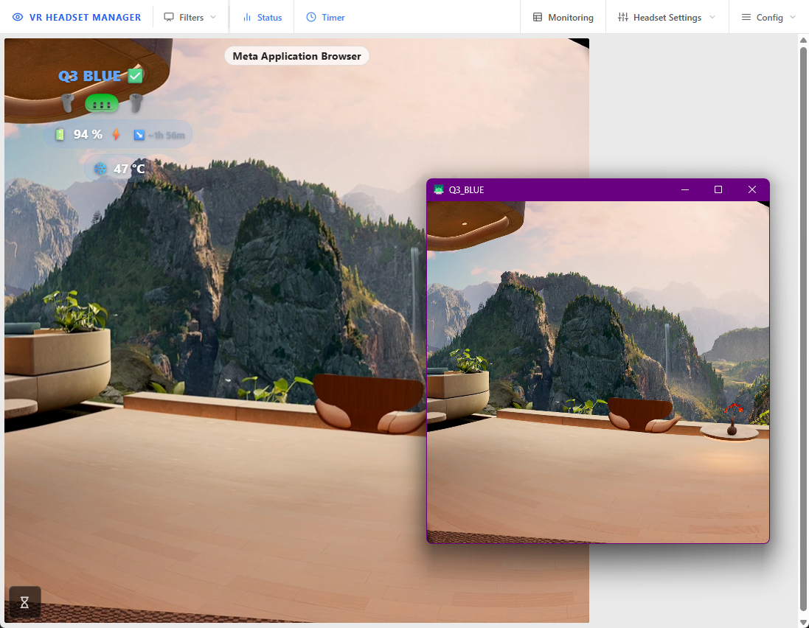
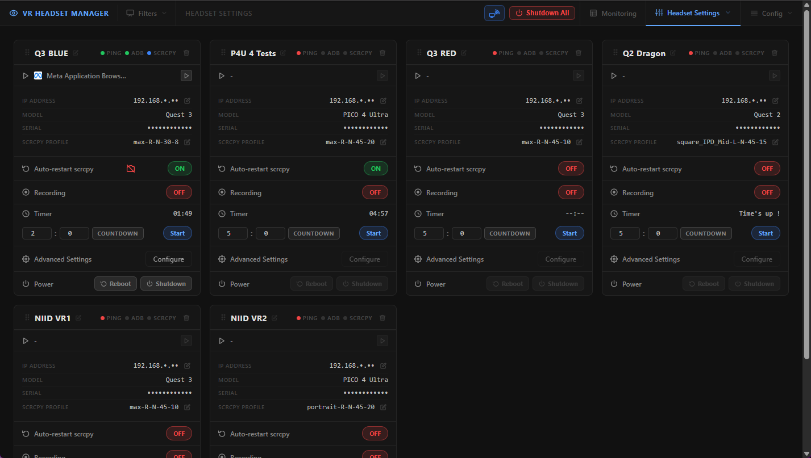
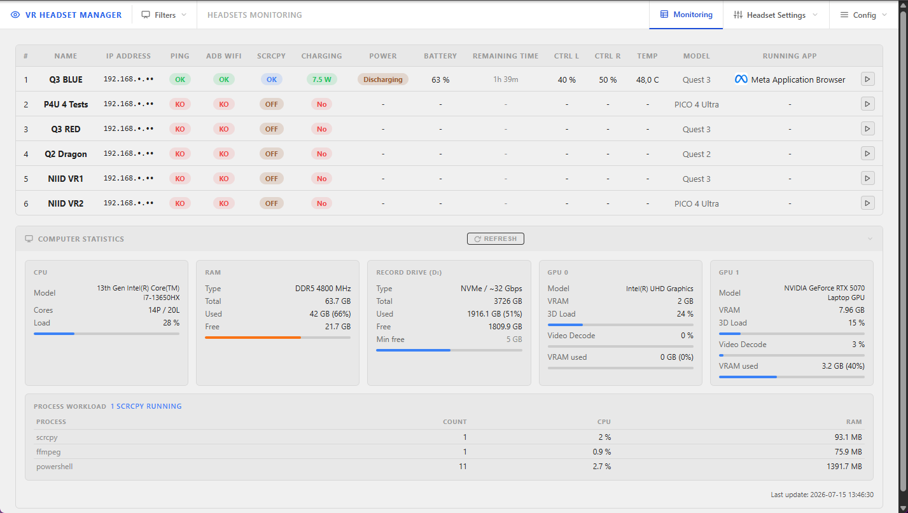

# Getting started

[← Back to documentation home](README.md)

This guide takes you from a freshly installed VR HEADSET MANAGER to a live headset stream, **using only the web interface**. (Everything shown here can also be done from the PowerShell console menu, but the web interface is the recommended way to work.)

## 1. Open the web interface

Start the application with `START_VR_HEADSET_MANAGER.cmd` if it is not already running. The console prints the web address — by default:

```
http://<your-pc-ip>:8080
```

Open it in a browser. The top navigation bar gives you access to every page:

- **Video Monitor** (home) — live wall of all headset streams
- **Monitoring** — status table (battery, temperature, connectivity)
- **Headset Settings** — per-headset cards: stream, record, timer, power
- **Config** menu — application configuration, apps manager, help & diagnostics

## 2. Add your first headset

> [!IMPORTANT]
> The headset must already be in **Developer Mode**. If it is not, follow the [official Meta tutorial](https://developers.meta.com/horizon/documentation/native/android/mobile-device-setup/) first.

### Option A — USB (recommended)

1. Connect the headset to the PC with a USB cable.
2. Put the headset on and **accept the "Allow USB debugging" prompt** shown inside it.
3. In the web interface, go to **Headset Settings** and click the **Manage New Devices** button (the small headset icon at the top), or open `http://<your-pc-ip>:8080/headsets_settings.html#manage` directly. (On a fresh install the page also shows a big **"Click here to add your first headset"** button.)
4. Your headset appears in the dialog. Click **Add this headset to the list**: VRHM reads the model and serial number, **enables ADB over WiFi automatically** (Enable WiFi ADB), and registers the headset with a friendly name.


*The Manage New Devices dialog with a USB-detected Quest 3, ready to be added in one click — WiFi ADB can be enabled from the same dialog.*

Once added, the headset gets its own card in **Headset Settings**:



### Option B — manually by IP address

If the headset already has ADB over WiFi enabled (see [how to enable it](docs_HowToEnableADBWifi.md)), you can skip the cable:

1. Find the headset's IP address (headset **Settings → WiFi → your network → Advanced**).
2. In **Manage New Devices**, click **Add manually new headset with IP address** and fill in the IP and a friendly name.

> [!NOTE]
> The first time VRHM connects over ADB, the headset asks you (inside VR) to authorize the computer. Tick "Always allow from this computer" and accept.

## 3. Start your first stream

1. Go to the **Video Monitor** page (the home page). Each registered headset has a tile.
2. Click the **stream button** on your headset's tile (or enable **Auto-restart scrcpy** — see below). After a few seconds the live video appears.

A scrcpy window also opens on the VRHM computer itself — this is the local capture window that feeds the stream.

> 📸 **SCREENSHOT TO ADD** — save as `docs/pics/scrcpy_window.png`
> *What to capture:* the Windows desktop of the VRHM computer showing the scrcpy mirror window of a headset (a single-eye cropped view of the VR content), ideally with the window title visible (it contains the headset name).

<!--  -->

## 4. Make the stream automatic

You usually do not want to click a button every time a headset wakes up. Enable auto-restart:

1. Go to **Headset Settings**.
2. On your headset's card, switch **Auto-restart scrcpy** to **ON**.


*One card per headset: stream status, IP/serial, capture profile, auto-restart, recording, session timer, and power controls.*

From now on, whenever the headset is reachable on the network, VRHM (re)starts the capture automatically — including after the headset went to sleep or rebooted.

## 5. Check headset health

Open the **Monitoring** page to see everything at a glance: ping/ADB/scrcpy status, charge state and power draw, battery levels (headset and both controllers), temperature, model, and the app currently running in the headset.


*The Monitoring table plus live computer statistics (CPU, RAM, GPU, recording drive, process workload).*

## Where to go next

- Put the streams into **OBS**, share them on the LAN, record sessions → [Streaming & OBS](streaming.md)
- Launch or install games remotely on the headsets → [Applications manager](apps-manager.md)
- Limit session time per player → [Timer API](docs_timer_api.md) (timers are also on each Video Monitor tile and Headset Settings card)
- Tune everything → [Configuration reference](configuration.md)
