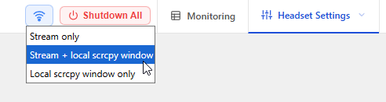
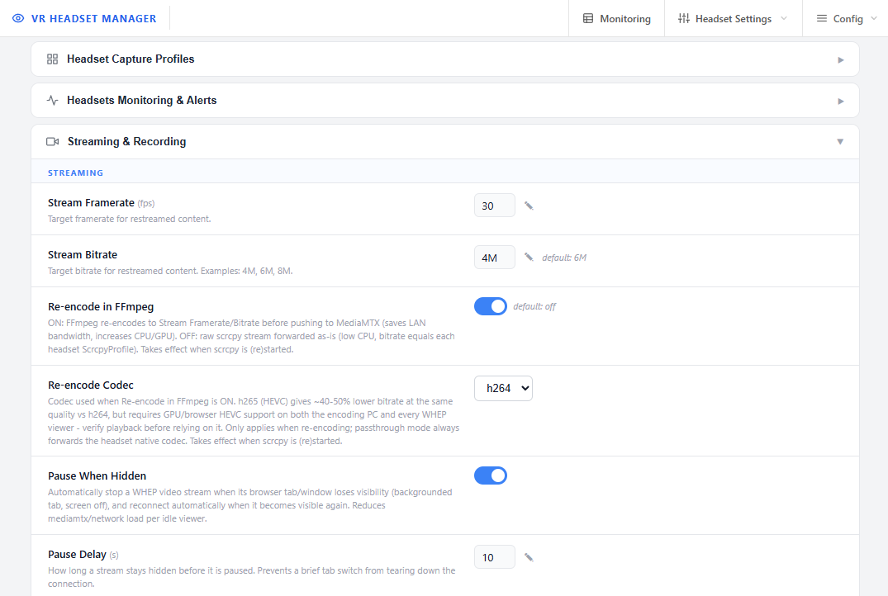
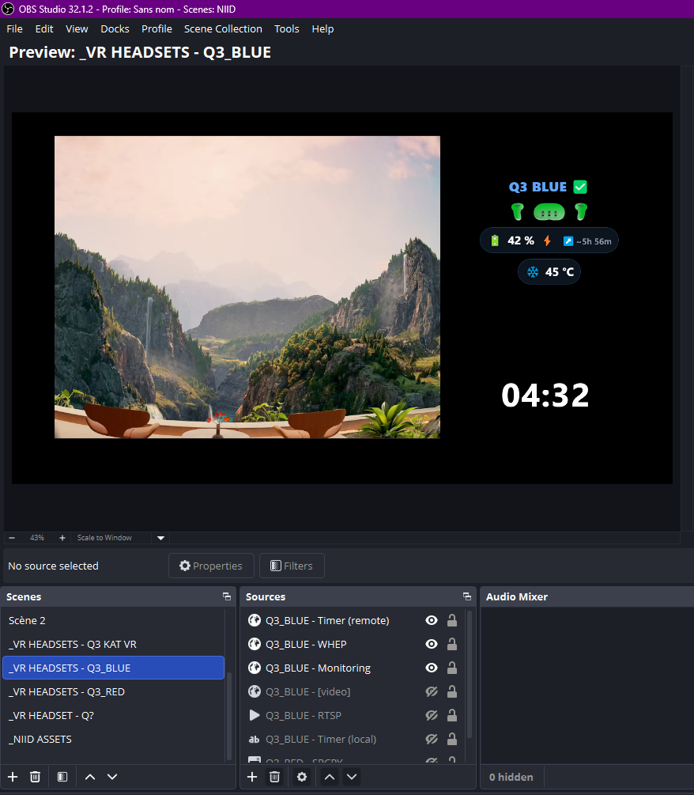

# Streaming, restreaming & OBS

[← Back to documentation home](README.md)

## How the pipeline works

```
┌──────────┐  WiFi ADB   ┌────────┐        ┌────────┐  RTSP   ┌──────────┐  RTSP / HLS / WHEP
│ Headset  │ ──────────► │ scrcpy │ ─────► │ ffmpeg │ ──────► │ MediaMTX │ ─────────────────► viewers
└──────────┘  (h264/h265)└────────┘ (pipe) └────────┘ publish └──────────┘   (web page, OBS, VLC...)
                              │
                              └──► local capture window on the VRHM PC
                              └──► optional recording to disk (-c copy)
```

1. **scrcpy** captures the headset screen over WiFi ADB, shows the local window, and writes the video to a relay pipe.
2. **ffmpeg** reads that pipe and publishes the stream to MediaMTX over RTSP. By default it **re-encodes the stream to a controlled framerate and bitrate** (30 fps / 6 Mbps), so the network load per viewer stays predictable — see [FFmpeg re-encoding](#ffmpeg-re-encoding-and-streaming-options).
3. **MediaMTX** makes the stream available to any number of viewers over three protocols simultaneously.

Everything is supervised: if a headset drops and comes back and **Auto-restart scrcpy** is enabled, the whole chain restarts by itself.

## Capture modes

The capture-mode selector in the **Headset Settings** top bar (config key `Performance.Capture_Mode`) chooses what happens with the scrcpy capture:



| Mode | Effect |
|---|---|
| **Stream only** | Publish to MediaMTX, no window on the PC (lightest on the GPU display side) |
| **Stream + local scrcpy window** (default) | Publish to MediaMTX and show the local mirror window |
| **Local scrcpy window only** | Just the mirror window — nothing is restreamed |

## scrcpy capture profiles

VR headsets render one image per eye with lens distortion, so raw mirroring looks bad on a flat screen. VRHM ships **per-model crop profiles** that extract one eye and straighten it.

A profile is stored as a compact string on each headset (editable in **Headset Settings**):

```
view-EYE-AUDIO-FPS-BW
 │     │    │    │  └─ video bitrate in Mbps          (e.g. 8)
 │     │    │    └─── max framerate                   (e.g. 30, 45, 60)
 │     │    └──────── audio duplication: N (no) / Y   (keep audio in headset AND stream it)
 │     └───────────── eye: L or R                     (which eye to crop)
 └─────────────────── view: max / square / portrait / wide / fullscreen
```

Example — `max-R-N-30-8`: maximum-area crop of the right eye, no audio duplication, 30 fps, 8 Mbps.

Available views (per model, defined in the [configuration](configuration.md#headset-capture-profiles-scrcpy)):

| View | Use for |
|---|---|
| `max` | Largest usable area of one eye (default) |
| `square` | 1:1 tile, dense video walls |
| `portrait` | Vertical screens |
| `wide` | 16:9-ish landscape framing |
| `fullscreen` | Raw both-eyes output, no crop |

Profiles exist out of the box for **Quest 3**, **Quest 2**, and **PICO 4 Ultra** — you can tune the crop rectangles or add new models in the config.

## FFmpeg re-encoding and streaming options

After scrcpy captures the headset, ffmpeg publishes the video to MediaMTX. How it does that is controlled by the **Streaming** options in **Config → App Configuration → Streaming & Recording**:



| Option | Default | What it does |
|---|---|---|
| **Re-encode in FFmpeg** | **ON** | ON: ffmpeg re-encodes every stream to the framerate/bitrate below before pushing it to MediaMTX — the LAN bandwidth per viewer is capped and identical for all headsets. OFF: passthrough (`-c copy`) — the raw scrcpy stream is forwarded untouched (zero quality loss, minimal CPU, but each viewer receives the full bitrate of the headset's capture profile). |
| **Re-encode Codec** | **h264** | Codec used when re-encoding. `h264` is the most compatible. `h265` (HEVC) gives roughly 40-50% lower bitrate at the same quality, but the encoding GPU **and every viewer** (browser/OBS) must support HEVC — verify playback before relying on it. In passthrough mode the headset's native codec is always forwarded. |
| **Stream Framerate** | **30 fps** | Target framerate when re-encoding. |
| **Stream Bitrate** | **6M** | Target bitrate when re-encoding (examples: `4M`, `6M`, `8M`). |
| **Pause When Hidden** | **ON** | Web viewers automatically stop their WHEP stream when the browser tab is hidden (backgrounded tab, screen off) and reconnect when visible again — idle viewers stop consuming network and MediaMTX resources. |
| **Pause Delay** | **10 s** | How long a stream must stay hidden before it is paused, so a brief tab switch does not tear down the connection. |

More about re-encoding:

- The GPU encoder is **auto-detected** in priority order for your hardware — NVENC (NVIDIA), Quick Sync (Intel), AMF (AMD) — with CPU x264/x265 as the guaranteed fallback
- Changes take effect when scrcpy is (re)started; the web UI restarts the affected streams automatically after saving
- [Video Quality Automation](vqa.md) can lower the stream framerate/bitrate automatically under CPU/GPU pressure

> [!NOTE]
> Re-encoding trades PC CPU/GPU for network bandwidth. Turn it **off** (passthrough) if you have few viewers and want the lowest possible CPU usage. Recordings are **always** stored with the original capture quality (`-c copy`), never re-encoded.

## Stream URLs

Every headset stream is published under a path derived from its name (e.g. `Q3 BLUE` → `q3_blue`), on three protocols:

| Protocol | URL | Best for |
|---|---|---|
| WHEP (WebRTC) | `http://<pc-ip>:8889/<name>` | OBS Browser source, web pages — lowest latency |
| RTSP | `rtsp://<pc-ip>:8554/<name>` | VLC, OBS Media source, other software |
| HLS | `http://<pc-ip>:8888/<name>/index.m3u8` | Browsers/players without WebRTC, many viewers |

You never have to build these by hand: **Config → Help & Diagnostics → Stream Links** lists ready-to-copy URLs for every headset with a LIVE/OFFLINE badge:


## OBS integration

Two ways to bring a headset into an OBS scene:

- **Browser source** (recommended, lowest latency): use the WHEP page URL of the headset — `http://<pc-ip>:8080/<HEADSET_NAME>[video].html` (also linked from Help & Diagnostics), or the raw WHEP URL above.
- **Media source**: use the RTSP URL. Untick *Local file*, set *Input* to `rtsp://<pc-ip>:8554/<name>`, and reduce network buffering for lower latency.

For headset health on stream, add a second **Browser source** pointing to the per-headset monitoring overlay:

```
http://<pc-ip>:8080/<HEADSET_NAME>[monitoring].html
```

It renders battery, controllers, charge and temperature with a transparent background, ready to overlay on the video.

> 📸 **SCREENSHOT TO ADD** — save as `docs/pics/obs_integration.png`
> *What to capture:* an OBS scene showing one headset video feed (Browser or Media source) with the `[monitoring].html` overlay on top displaying battery/controller icons, plus the Sources panel visible so readers can see the two sources used.

<!--  -->

To limit session time on stream, pair OBS or a Stream Deck with the [Timer API](docs_timer_api.md).

## Recording

Enable **Recording** on a headset's card in **Headset Settings** to save its capture sessions to disk.

- Files go to the configured record folder (default `C:\DATA\MEDIA\VR_Records`, see [configuration](configuration.md#headset-capture-profiles-scrcpy))
- The recording is a lossless copy of the capture (no re-encoding)
- A **minimum free space guard** (default 5 GB) automatically disables recording on all headsets when the drive runs low; the web UI shows a storage warning banner

---

Related: [Web interface tour](web-interface.md) · [Configuration reference](configuration.md) · [Video Quality Automation](vqa.md)
