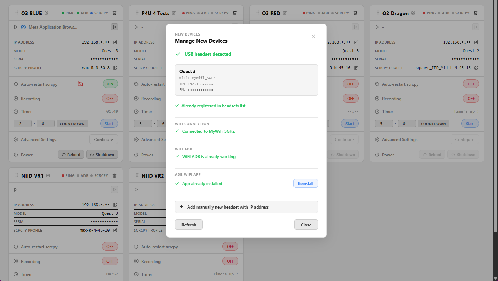
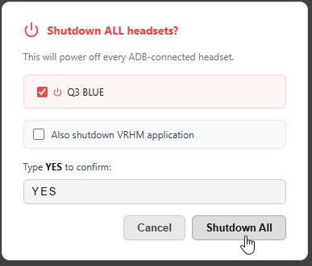
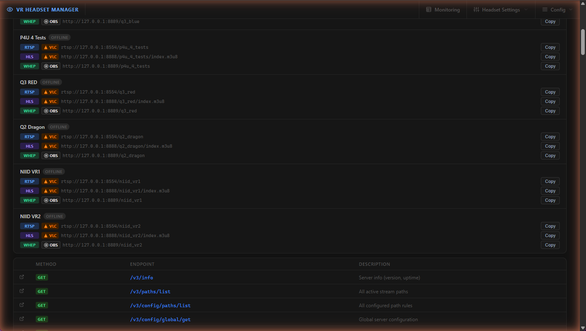

# Web interface tour

[← Back to documentation home](README.md)

The web interface is served by VR HEADSET MANAGER's built-in web server, enabled by default on port **8080** (changeable in the [configuration](configuration.md#webserver)). It is reachable from **any device on your LAN**:

```
http://<your-pc-ip>:8080
```

> [!NOTE]
> A few operations that need direct file access (like picking a local APK file to sideload) are only available when you browse from the computer running VRHM.

## Video Monitor (home page)

The live video wall. One tile per headset showing the real-time stream (WHEP/WebRTC, very low latency), with overlays for battery, controllers, charge status and the session timer.


Top-bar controls:

- **Filters** — choose which headsets are displayed
- **Status** — toggle status overlays (battery, controllers, temperature)
- **Timer** — show/hide and control per-headset session timers
- Per-tile **launch app** button (▶) — start an installed application inside the headset without touching it

Tiles of offline headsets show their last known status; the video reconnects automatically when the stream comes back.

## Monitoring

A status table of the whole fleet, refreshed live:


- Per headset: ping / ADB WiFi / scrcpy status, charging state and power draw (W), battery percentages (headset + left/right controllers), estimated remaining time, temperature, model, and the **application currently running** in the headset
- **Computer statistics**: CPU, RAM, recording drive usage and type, per-GPU load/VRAM, and the workload of the capture processes (scrcpy, ffmpeg, PowerShell)
- When [Video Quality Automation](vqa.md) is enabled, its recommendation panel and auto-apply toggles appear on this page

## Headset Settings

One card per headset with every day-to-day control:


- Live status dots (PING / ADB / SCRCPY) and running app, with launch button
- **IP address**, model, **serial number**, and the assigned [capture profile](streaming.md#scrcpy-capture-profiles) — all editable
- **Auto-restart scrcpy** — keep the capture running automatically
- **Recording** — record the capture to disk ([details](streaming.md#recording))
- **Timer** — set and start a session countdown
- **Advanced Settings** (Configure) — brightness, guardian, proximity sensor, OTA update blocking, firmware info...
- **Power** — reboot or shut the headset down remotely
- Top bar: **Manage New Devices** (add headsets — see [Getting started](getting-started.md#2-add-your-first-headset)), the **capture mode** selector (see [Streaming → capture modes](streaming.md#capture-modes)), and **Shutdown All**


*Manage New Devices: USB detection with WiFi/ADB status checks, plus manual add by IP address.*

**Shutdown All** powers off every ADB-connected headset at once (with a confirmation dialog — it can optionally close the VRHM application too):



## Config menu

### App Configuration

Edit the whole application configuration from the browser. Changes are saved automatically; most take effect immediately, streaming-related changes restart the affected services on the fly.


Sections: General, WiFi Networks, Headset Capture Profiles, Headsets Monitoring & Alerts, Streaming & Recording, Video Quality Automation, Services & Network, Advanced/Internal. The **Edit config.json** button opens the raw file, and **Reset to Template** restores defaults. See the [Configuration reference](configuration.md).

### Headsets Apps (Application Manager)

Install, uninstall, update, and launch applications per headset — see the dedicated [Applications manager](apps-manager.md) page.


### Known Apps

The shared catalog that maps Android package names to friendly display names and icons, fed by the [MetaMetadata](https://github.com/threethan/MetaMetadata) database:


See [Applications manager → Known apps catalog](apps-manager.md#known-apps-catalog).

### Help & Diagnostics

Service control and troubleshooting from the browser:



- **Shutdown Application**, **Restart Web Server**, **Restart MediaMTX** (with live PIDs)
- **Stream Links — VLC & OBS**: ready-to-copy RTSP / HLS / WHEP URLs for every headset, with LIVE/OFFLINE badges — paste them straight into VLC or OBS ([more](streaming.md#stream-urls))
- The MediaMTX API endpoints for advanced diagnostics

### Timer control

A dedicated page to drive all session timers at once; the same functions are exposed by the [Timer API](docs_timer_api.md) for Stream Deck / OBS integration.

### Kiosk Screens

Remote-control browser displays on the LAN (lobby TVs, showroom monitors) — push a URL, cast a headset's live feed to a screen, or kill its browser. See the dedicated [Kiosk screens](kiosk-screens.md) page.
