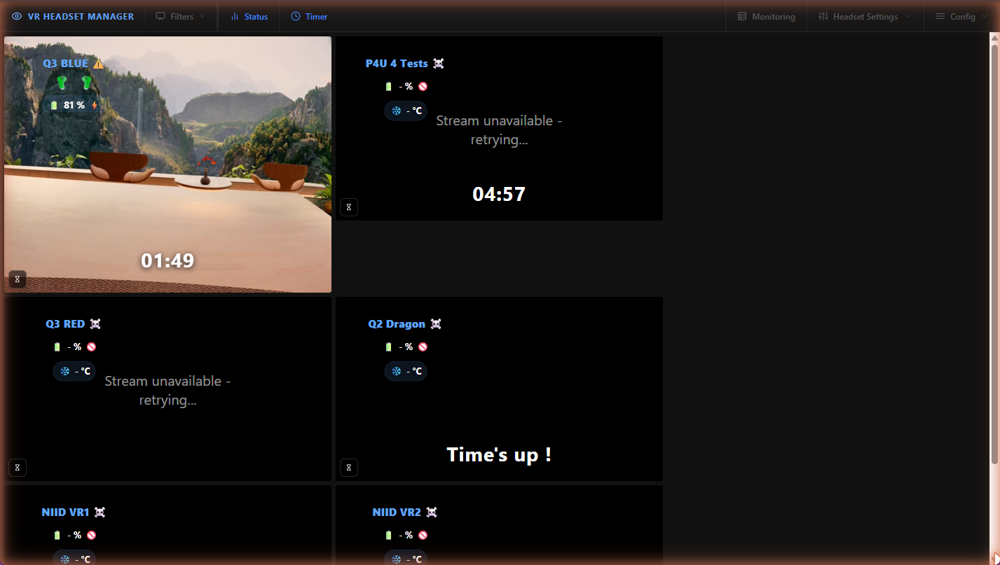
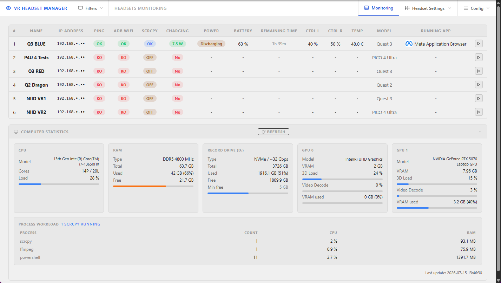
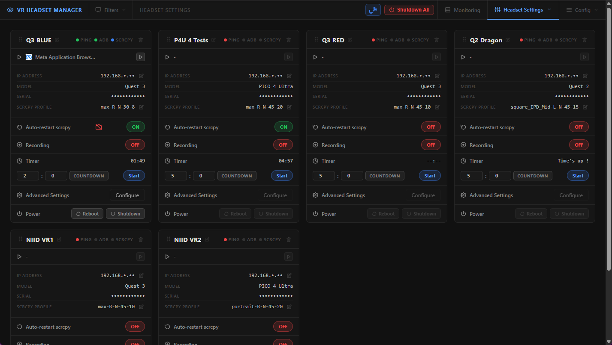
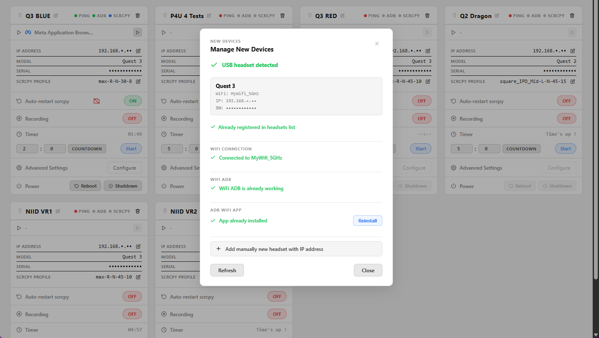
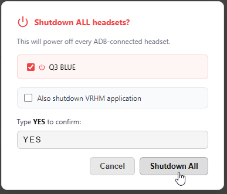
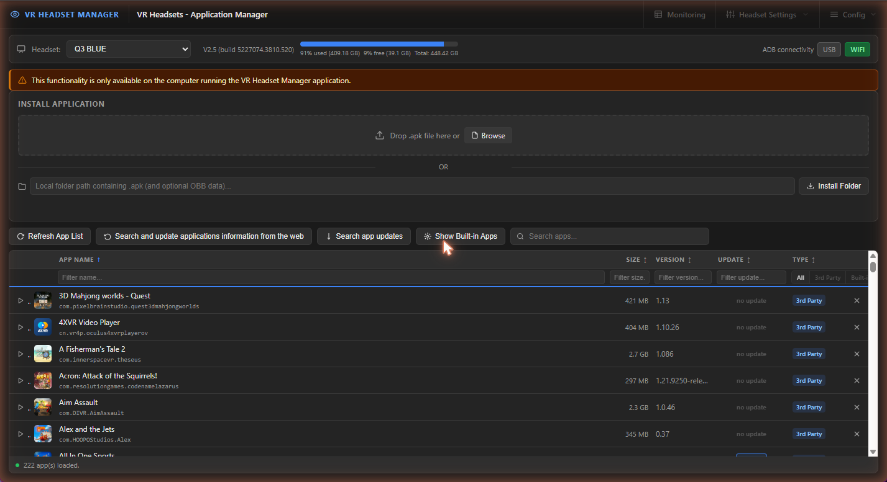
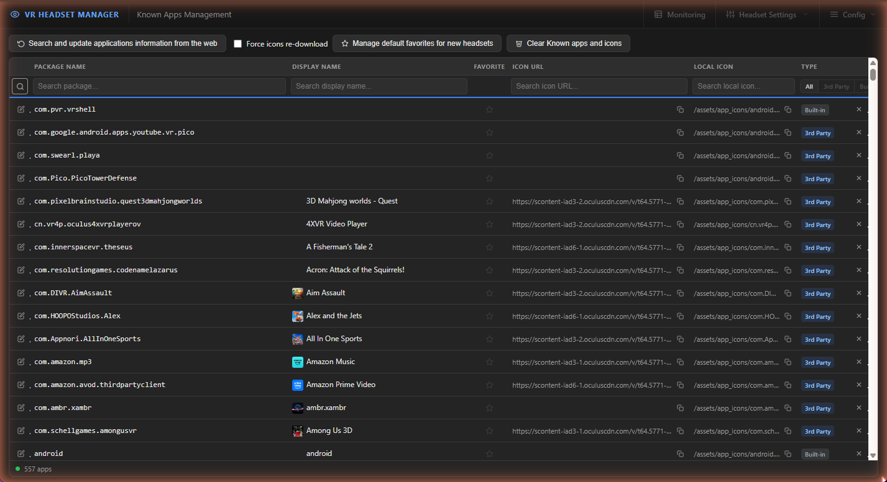
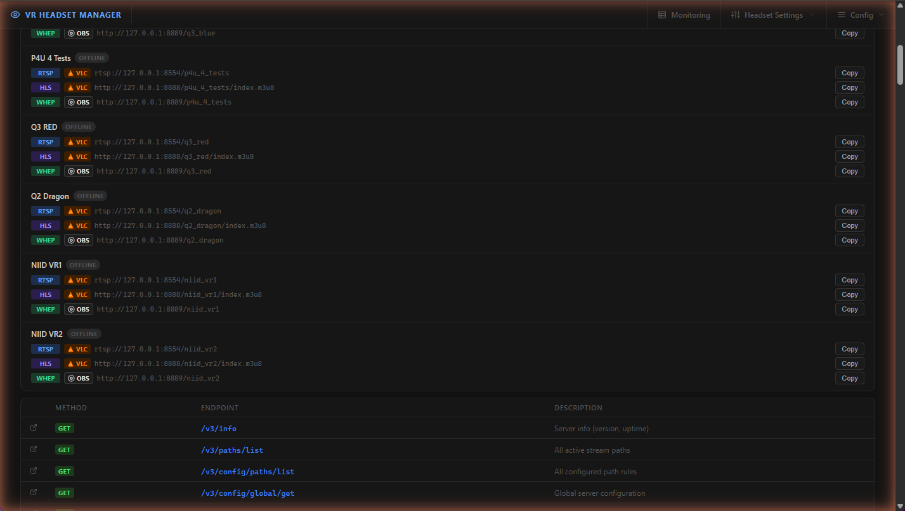

# Web interface tour

[← Back to documentation home](README.md)

The web interface is served by VR HEADSET MANAGER's built-in web server, enabled by default on port **8080** (changeable in the [configuration](configuration.md#webserver)). It is reachable from **any device on your LAN**:

```
http://<your-pc-ip>:8080
```

> [!NOTE]
> A few operations that need direct file access (like picking a local APK file to sideload) are only available when you browse from the computer running VRHM.

## Video Monitor (home page)

The live video wall. One tile per headset showing the real-time stream (WHEP/WebRTC, very low latency), with overlays for battery, controllers, charge status and the session timer.



Top-bar controls:

- **Filters** — choose which headsets are displayed
- **Status** — toggle status overlays (battery, controllers, temperature)
- **Timer** — show/hide and control per-headset session timers
- **Wall view** (eye-slash icon) — hides the whole top bar and switches to a live-streams-only filter, so the page fills the window edge-to-edge for a lobby TV / showroom wall. A small restore control stays in the corner to bring the bar back. The state is reflected in the URL as `?hidetopbar=1`, so it can be bookmarked or pushed straight to a [kiosk screen](kiosk-screens.md#casting-a-headsets-video-feed-to-a-kiosk). Add `&nooverlay=1` to also suppress the status/timer overlays on every tile from the start (skips starting the per-headset timer polling too, for a lighter wall view) — e.g. `http://<pc-ip>:8080/?hidetopbar=1&nooverlay=1`.
- Per-tile **launch app** button (▶) — start an installed application inside the headset without touching it

Tiles of offline headsets show their last known status; the video reconnects automatically when the stream comes back.

## Monitoring

A status table of the whole fleet, refreshed live:



- Per headset: ping / ADB WiFi / scrcpy status, charging state and power draw (W), battery percentages (headset + left/right controllers), estimated remaining time, temperature, model, and the **application currently running** in the headset
- **Computer statistics**: CPU, RAM, recording drive usage and type, per-GPU load/VRAM, and the workload of the capture processes (scrcpy, ffmpeg, PowerShell)
- When [Video Quality Automation](vqa.md) is enabled, its recommendation panel and auto-apply toggles appear on this page

## Headset Settings

One card per headset with every day-to-day control:



- Live status dots (PING / ADB / SCRCPY) and running app, with launch button. The ADB label shows the transport in use (`ADB USB` when the headset is cabled to this PC, `ADB WiFi` otherwise)
- **IP address**, model, **serial number**, and the assigned [capture profile](streaming.md#scrcpy-capture-profiles) — all editable
- **Auto-restart scrcpy** — keep the capture running automatically
- **Recording** — record the capture to disk ([details](streaming.md#recording))
- **Timer** — set and start a session countdown
- **Advanced Settings** (Configure) — brightness, guardian, proximity sensor, OTA update blocking, firmware info...
- **DIAG** — opens the [diagnostics page](#headset-diag) of that headset
- **Power** — reboot or shut the headset down remotely
- Top bar: **Manage New Devices** (add headsets — see [Getting started](getting-started.md#2-add-your-first-headset)), the **capture mode** selector (see [Streaming → capture modes](streaming.md#capture-modes)), and **Shutdown All**


*Manage New Devices: USB detection with WiFi/ADB status checks, plus manual add by IP address.*

**Shutdown All** powers off every ADB-connected headset at once (with a confirmation dialog — it can optionally close the VRHM application too):



## Headset DIAG

`headset_diag.html?id=<headset id>`, opened by the **DIAG** button of a headset card. One page per headset, refreshed on demand or automatically (default every 30 s, see the [`Diag`](configuration.md#diag) settings). A badge shows the ADB transport that actually answered the last read (USB or WiFi - if the cable dropped mid-call and the retry went over WiFi, it says WiFi). The **Link** selector chooses which transport is tried first (Auto follows `ADB.prefer_usb`; USB first or WiFi first override it for this page only, and the other stays the fallback), so you can test the WiFi link of a cabled headset without changing any setting.

- **Firmware** — OS version, firmware version, build, system components, pending update and its progress, whether the updater is blocked, private DNS. A fleet comparison flags a headset that is behind the newest firmware of its model (from what this server has seen, no internet lookup) and a history lists recorded firmware changes.
- **Health** — CPU, GPU, skin and battery temperatures (click a tile for its history graph), throttling level, fan, battery health and capacity, controllers, busiest processes, memory, boot stage, clock drift, time zone and camera errors.
- **Wireless** — WiFi link (SSID, band, signal, link speed), saved networks, whether Meta servers are reachable from the headset, Bluetooth state and bonded devices.
- **USB / cable** — only shown when the headset is cabled: link speed, Windows connect/disconnect events, devices Windows flags, and a throughput test of the cable.
- **Operator actions** — Bluetooth on/off and pairing screen, clock sync, private DNS reset, updater disable, enable/disable an app, a message for the player (it only reaches the headset notification center, not the player view; an overlay is planned for the companion app) and typed text, and gentle recovery (wake, home, restart shell, restart System UX). Disruptive ones ask for confirmation.
- **ADB shell** — presets or free text. Shell only, 20 s timeout, 64 KB output, a short deny list (bootloader, fastboot, wipe, rm -rf on the root), and every command is written to the log.
- **ADB over TLS** *(experimental)* — evidence gathering about Wireless debugging; it does not change how headsets are onboarded.

CPU, GPU and skin temperatures are also recorded in the [metric history](web-interface.md#monitoring) and shown on its graph. CPU and GPU are the hottest core, because that is the one that throttles. Battery is the sensor Android calls `battery` (the same value as the Temperature column), and skin is the virtual surface sensor, not the hottest internal chip. These tiles read the live values from the headset thermal service, so under load CPU and GPU of 60 C or more are normal. DIAG is web-only by design (ADR-0023).

**Changing a headset's WiFi network.** The *Saved networks* list in the Wireless card has a **Switch** button next to every network except the connected one, and the **WiFi networks** card has **Scan available networks** (scanned by the headset's own radio, not by this PC) with a **Select** button per result and a connect form (SSID, password, *Save this password on the server*). Rules the page enforces for you:

- The headset only joins a network it can see in its own scan. Otherwise nothing is changed and the page says so, because a headset moved to an unreachable network is stranded.
- A password typed here is sent to the headset over ADB and is never logged or shown again. Leave it empty to use the one stored in the server's encrypted WiFi store; if there is none, the form asks for it. *Save this password on the server* stores it there only after the switch succeeded.
- When the headset is reached over WiFi, the connection drops as it leaves the network, so the result is reported as unconfirmed and the password is not saved. Use the cable for a confirmed switch.
- Open and WPA2/WPA3 networks work. Enterprise (EAP) networks must be joined on the headset. PICO headsets cannot be moved over ADB: the WiFi settings screen is opened on the headset instead.

## Config menu

### App Configuration

Edit the whole application configuration from the browser. Changes are saved automatically; most take effect immediately, streaming-related changes restart the affected services on the fly.


Sections: General, WiFi Networks, Headset Capture Profiles, Headsets Monitoring & Alerts, Streaming & Recording, Video Quality Automation, Services & Network, Advanced/Internal. The **Edit config.json** button opens the raw file, and **Reset to Template** restores defaults. See the [Configuration reference](configuration.md).

### Headsets Apps (Application Manager)

Install, uninstall, update, and launch applications per headset — see the dedicated [Applications manager](apps-manager.md) page.



### Known Apps

The shared catalog that maps Android package names to friendly display names and icons, fed by the [MetaMetadata](https://github.com/threethan/MetaMetadata) database:



See [Applications manager → Known apps catalog](apps-manager.md#known-apps-catalog).

### Help & Diagnostics

Service control and troubleshooting from the browser:



- **Shutdown Application**, **Restart Web Server**, **Restart MediaMTX** (with live PIDs)
- **Stream Links — VLC & OBS**: ready-to-copy RTSP / HLS / WHEP URLs for every headset, with LIVE/OFFLINE badges — paste them straight into VLC or OBS ([more](streaming.md#stream-urls))
- The MediaMTX API endpoints for advanced diagnostics

### Timer control

A dedicated page to drive all session timers at once; the same functions are exposed by the [Timer API](docs_timer_api.md) for Stream Deck / OBS integration.

### Kiosk Screens

Remote-control browser displays on the LAN (lobby TVs, showroom monitors) — push a URL, cast a headset's live feed to a screen, or kill its browser. See the dedicated [Kiosk screens](kiosk-screens.md) page.
